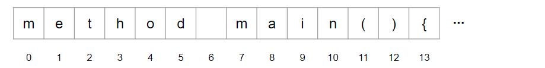

---
hide:
    - navigation
title: Language Reference
description: Brio Lang reference that describes the syntax and semantics of the language.
---
# Language Reference

## Introduction
Brio Lang is implemented in C++, and utilizes various principles and patterns inspired from languages such as Javascript and Python. This document describes the syntax and semantics of the language.

*Note: This document is not complete!*

## Lexical Analysis
A Brio Lang program is read by the lexer, which iterates through the source input file as a stream of characters and generates a stream of tokens. Unicode is the default source encoding, and white space is ignored. If a source file cannot be found or has an unsupported encoding, an error will be raised.

For the example program:

```brio
method main(){
    let x = "Hello, world!"
    print(x)
}
```

The lexer will read the stream of characters:


And produce the following stream of tokens:


### Tokens
The tokens produced by the Brio Lang parser will be of the following types:

| Token | Description / Example |
| ------ | ------ |
| T_EOF | special token for end of file |
| T_KEYWORD | class, method, new, let, return, @, etc. |
| T_IDENTIFIER | foo,  bar123,  my_identifier,  CAPITAL_ID |
| T_OPERATOR | `=`  `+`  `-`  `*`  `/`  `==`  `>`  `<<`  `>>`  `>`  `>=`  `<=`  `!=`, `+=`, `/=`, `*=`, `-=` |
| T_DELIMITER | `(` `)` `{` `}` `[` `]` `;` |
| T_LITERAL_INT | 42 |
| T_LITERAL_DECIMAL | 3.14 |
| T_LITERAL_STRING | "hello, world"  or  'foo bar' |
| T_LITERAL_BOOL | true  or  false |
| T_LITERAL_NONE | none |
| T_SINGLE_LINE_COMMENT | # this is a comment |
| T_MULTI_LINE_COMMENT | ### multi line comment ### |

### Comments
Brio Lang supports single-line and multi-line comments and start with one or more hash `#` characters. Single-line comments conclude at the new line character, and multi-line comments conclude at the next `###`.
```brio
# single-line comment
```

```brio
###
multi-line comment
with two lines
###
```

### Keywords
The following identifiers are reserved keywords in Brio Lang and cannot be used as a variable or class identifier. They are case-sensitive and must be spelled exactly as shown below: 

| Keywords | | | |
| ------ | ------ | ------ | ------ |
| class | protected | if | raise |
| let | public | elseif | as |
| method | private | else | while |
| new | try | skip | for |
| return | catch | and | import |
| or | from | each |

### Identifiers
Identifiers in Brio Lang can be defined with one or more of the following characters: any uppercase or lowercase letter A through Z, optionally followed by subsequent unsigned integers or underscores. Reserved keywords cannot be used as standard variable or class identifiers. Identifiers are case-sensitive, and can be unlimited in length.

```brio
myIdentifier  # valid
var123  # valid
CONST_DATA  # valid

my-identifier  # invalid
1_variable  # invalid
```

## Operators
Brio Lang supports the following assignment, binary, bitwise, and boolean operators: `=`, `+=`, `-=`, `*=`, `/=`, `&=`, `|=`, `+`, `-`, `*`, `\`, `**`, `%`, `<`, `<=`, `==`, `>=`, `>`, `<<`, `>>`, `&`, `|`, `^`.

### Operator Precedence
Highest precedence at the top, lowest at the bottom. Operators in the same box evaluate left to right.

| Operator | Binding Power | Description |
| ------ | ------ | ------ |
| () | 90 | Parentheses (grouping) |
| . | 80 | Attribute reference |
| ** | 70 | Exponentiation |
| *, /, % | 60 | Multiplication, division, remainder |
| +, - | 50 | Addition, subtraction |
| >>, << | 40 | Bitwise shifts |
| & | 35 | Bitwise AND |
| ^ | 34 | Bitwise XOR |
| ｜ | 33 | Bitwise OR |
| <, >, <=, >=, ==, != | 30 | Comparisons, identity |
| and | 25 | Boolean AND |
| or | 24 | Boolean OR |
| =, +=, -=, *=, /=, ｜=, &= | 10 | Assignment |

## Statements
Statements are constructed of a pattern of valid keywords, identifiers, and operators. Statements may be terminated with a trailing semi-colon `;` depending on the programmers preference, however it is not required. Statements can be used to assign values, control execution flow, print or capture input, and much more.

```brio
let x = 1;  # valid with trailing semi-colon

let y = 2  # also valid without semi-colon
```

For further examples please refer to the [tutorial](tutorial.md#control-flow).


## Data Model
Every data type in Brio Lang derives from a common `Object` class. Objects have a type, an identity, and a value. The type will determine which operations are permissible, and also dictates acceptable values. 

## Abstract Syntax Tree
The Brio Lang parser takes a stream of tokens provided by the lexer, and generates a homogenous abstract syntax tree which is walked and executed by the interpreter. Each statement in Brio Lang is comprised of a pattern of one or more tokens. Each logical construct is represented in the AST as a node that contains one or more children. 

For example, the input `"Text"` would be provided to the parser as a `T_LITERAL_STRING` token, which would be defined as a terminal (or leaf) node `LiteralStringNode` in the AST that has no children. 

As another example the input `let x = 1` would be read by the parser as `T_KEYWORD`, `T_IDENTIFIER`, `T_OPERATOR`, `T_LITERAL_INT` and would be represented in the AST as a nonterminal  `VarDeclarationNode`, that has two immediate children, `IdentifierNode` and `LiteralIntNode`.

The full list of AST nodes is defined below. Given the homogeneous approach, all nodes inherit from a common base AST node and do not have varying class attributes. The root node of a Brio Lang AST is `ProgramNode`.

| Nodes | | | |
| ------ | ------ | ------ | ------ |
| ProgramNode | VarDeclarationNode | VarAssignmentNode | AdditionAssignNode | 
| SubtractionAssignNode | MultiplicationAssignNode | DivisionAssignNode | BitOrAssignNode |
| BitAndAssignNode | ClassDeclarationNode | ClassInstantiationNode | MethodDeclarationNode |
| MethodCallNode | ModifierNode | ParamsListNode | ParenthesesNode |
| BinExpressionNode | BoolExpressionNode | BitExpressionNode | BitOrExpressionNode |
| BitAndExpressionNode | BitXorExpressionNode | ModulusExpressionNode | ExponentExpressionNode |
| AddExpressionNode | SubtractExpressionNode | MultiplyExpressionNode | DivideExpressionNode |
| IfStatementNode | IfConditionBlockNode | ImportNode | ImportedModuleNode |
| FromImportNode | ForStatementNode | WhileStatementNode | SkipStatementNode |
| TryStatementNode | CatchStatementNode | RaiseStatementNode | AsNode |
| MemberAccessNode | IndexNode | BlockNode | SuperClassNode |
| LiteralStringNode | LiteralIntNode | LiteralDecimalNode | LiteralBooleanNode |
| LiteralNoneNode | ArrayNode | DictionaryNode | DictionaryKeyValueNode |
| ReturnNode | IdentifierNode | BoolOrNode | BoolAndNode |
| BoolEqualsNode| BoolNotEqualsNode| BoolGreaterThanNode| BoolGreaterThanOrEqualNode |
| BoolLessThanNode| BoolLessThanOrEqualNode| BitShiftLeftNode| BitShiftRightNode |
| EachStatementNode | | | |
  
## Interpreter
The Brio Lang interpreter implements a recursive descent pattern with backtracking to walk-through and execute the abstract syntax tree produced by the parser. Once the AST has been generated, the interpreter will do an initial walk and rewrite sub-trees to enforce operator precedence. With the modified tree, the interpeter will perform a second walk to populate the symbol table and build a scope tree, updating nodes in the AST with bidirectional pointers along the way. 

With the revised AST and populated symbol table, the interpreter will begin to execute the AST starting with the root `ProgramNode`. First each child `ImportNode` will be executed, which will read and parse an import file, produce a secondary AST, and add it in to the main AST. As this takes place, the original `ImportNode` will become an `ImportedModuleNode`. If imports are found and added to the program AST, the def/ref phases will be re-run to ensure the symbol table is aware of any new references. Next, any child class declarations or variable declarations will be executed. Finally, the interpreter will find the `main()` method and begin to execute. If a `main()` method node is not found, the interpreter will raise an error.

## Full Grammar Specification
```
<program> ::= (<statement>)+
<block> ::= "{" (<statement>)* "}"
<statement> ::= <method_decl> |
                <var_decl> |
                <class_decl> |
                <if_stmt> |
                <for_stmt> |
                <each_stmt> |
                <while_stmt> |
                <return_val> |
                <class_inst> |
                <method_call> ";" |
                <import> |
                <import_from> |
                <expr>
<import> ::= "import" <id>
<import_from> ::= "from" <id> "import" <id>
<method_decl> ::= (<modifier>)* "method" <id> <params_list> <block> ";"
<method_call> ::= (<id> ".")* <id> <params_list> ";"
<class_decl> ::= (<modifier>) "class" <id> <block> ";"
<class_inst> ::= "new" <id> <params_list> ";"
<var_decl> ::= "let" <id> "=" <class_inst> ";" |
                              <expr> ";"
<var_assign> ::= (<id> ".")* <id> "=" <expr> ";"
<params_list> ::= "(" (<expr>)* ")"
<array_list> ::= "[" (<expr>)* "]"
<dictionary> ::= "{" <expr> ":" <expr> "}"
<return_val> ::= "return" [<expr>] ";"
<modififer> ::= "public" | "private" | "protected"
<if_stmt> ::= "if" "(" <test> ")" <block> 
              ("elseif" "(" <test> ")" <block>)* 
              ("else" <block> ) ";"
<for_stmt> ::= "for" "(" <var_decl> ";" <test> ";" 
                <statement> ")" <block> ";"
<each_stmt> ::= "each" "(" <var_decl> ":" <expr> ")" <block> ";"
<while_stmt> ::= "while" "(" <test> ")" <block> ";"
<expr> ::= <var_assign> | <method_call> | <as> | <test>
<as> ::= <id> "as" <id>
<test> ::= <boolop> | <bitop> | <binop>
<boolop> ::= <term> "<" <test> |
             <term> ">" <test> |
             <term> ">=" <test> |
             <term> "<=" <test> |
             <term> "==" <test> |
             <term> "!=" <test> |
             <term> "and" <test> |
             <term> "or" <test>
<binop> ::= <term> "+" <binop> | <term> "-" <binop> | 
            <term> "*" <binop> | <term> "/" <binop> |
            <term> "%" <binop> | <term> "**" <binop> |
            <bitop> | 
            <term>
<bitop> ::= <term> ">>" <term> |
            <term> "<<" <term> |
            <term> "^" <term> |
            <term> "&" <term> |
            <term> "|" <term>
<parentheses> :: = "(" (<test>)+ ")"
<term> ::= <id> | <int> | <decimal> | <string> | <parentheses> |
           <array_list> | <member_asc> | <index_ascr> |
           <bool> | <dictionary> | <none>
<modifier> ::= "public" | "private"           
<member_asc> ::= ["@"] (<id> .)* <id>
<index_acsr> ::= <id> ("[" <term> "]")+
<id> ::= "a" | "b" | "c" | "d" | ... | "z" | _ | 0 | ... | 9 |
<bool> ::= "true" | "false"
<int> ::= <an_unsigned_integer>
<none> ::= "none"
<decimal> ::= <an_unsigned_decimal_integer>
<string> ::= <set_of_unicode_characters>
```