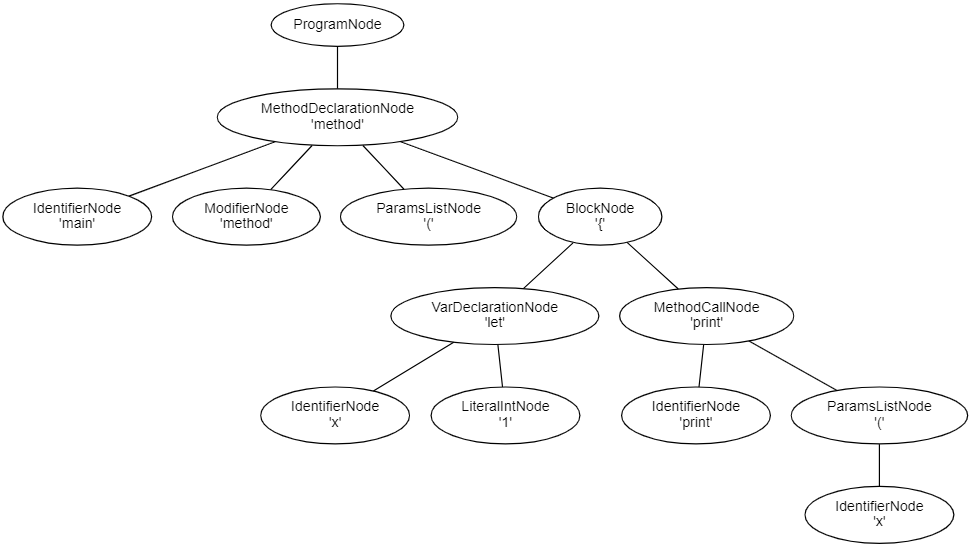

---
hide:
    - navigation
title: Tutorial
description: Brio Lang is an easy to learn programming language. Introduces reader to the basic concepts and features of the language.
---
# Brio Lang Tutorial

Brio Lang is an easy to learn programming language. This tutorial introduces the reader to the basic concepts and features of the Brio Lang programming lanugage and execution engine.

## Using the Interpreter
The Brio Lang interpreter can be started by running `./bin/brio` from the directory where the project was built. You may opt to introduce a symbolic link to your binary which will allow you to simply type `brio` to launch the interpreter.
```sh
$ ln -s /path/to/brio-lang/bin/brio /usr/local/bin/brio
```

### Execute a Program
Brio Lang programs have the file extension `.brio` and can be run by invoking the interpreter and providing the path to the program.
```sh
$ brio ./my_app.brio
```

### Interactive Mode
Running `brio` without any arguments, or `brio -i`, will launch the read-eval-print loop so you can experiment with expressions and statements. 
```
Brio Lang 0.6.0 (Feb 20 2021, 11:33:11)
[g++ 7.4.0] on 4.19.128-microsoft-standard
Type "help", "license", or "copyright" for more information.
>>>
```

You can cycle through the history of statements using your keyboard arrows ++up++ and ++down++.

To exit the interpreter, run the `exit()` method, press ++ctrl+d++, or press ++ctrl+c++. 

### Optional Arguments
If you supply the `-gv` argument when running a program, a DOT graph will be generated that allows you to visualize the abstract syntax tree constructed from the input source code. The graph will be created alongside the program, with the `.gv` file extension.

For example, the program below would produce the following AST.
```brio
method main(){
    let x = 1
    print(x)
}
```
```
$ brio -gv ./my_app.brio
1
```



Similarly, if you supply the `-ast` argument, a text-based representation of the AST will be printed to the console.

```sh
$ brio -ast ./my_app.brio
```

```
AST Nodes:
(ProgramNode)  children=1
--(MethodDeclarationNode)  children=3
----(IdentifierNode)  children=0
----(ParamsListNode)  children=0
----(BlockNode)  children=1
------(VarDeclarationNode)  children=2
--------(IdentifierNode)  children=0
--------(LiteralIntNode)  children=0
```

To see all available arguments, run `brio --help`.
```sh
$ brio --help       
```
```
brio-lang: version 0.8.0
usage: ./brio [-h] [-v] [-i] [-t] [-gv] [-sym] [-ast] FILE.brio

optional arguments:
  -h, --help                  Prints the help information
  -v, --version               Prints the version
  -i                          Runs in interactive mode (read-eval-print-loop)
  -t                          Prints the tokens from the lexer
  -gv                         Outputs a DOT file for visualizing the AST
  -sym                        Prints the symbol table globals
  -ast                        Prints each node type in the AST
  -fcgi                       Starts FastCGI listener, must be called from spawn-fcgi
```


## Using Brio Lang as a Calculator
### Numbers
The Brio Lang interpreter can be used as a simple calculator that supports the common operators `+`, `-`, `*`, `/` for addition, subtraction, multiplication, and division respectivley. Expressions can be grouped in parenthesis `(` `)` to specify order of operations. For example:

```brio
>>> 5 + 10 / 5
7
```

```brio
>>> (5 + 10) / 5
3
```

Division will produce a `Decimal` or `Integer` based on the divisibility of the numerator and denominator:

```brio
>>> 100 / 50  # Integer
2
```

```brio
>>> 50 / 100  # Decimal
0.5
```

```brio
>>> 22 / 7  # Decimal
3.142857
```

Brio Lang offers the `**` operator to calculate powers:

```brio
>>> 4 ** 2  # 4 squared
16
```

```brio
>>> 2 ** 5  # 2 to the power of 5
32
```

```brio
>>> 2 ** 4 + (20 - 5)
31
```

Additionally, Brio Lang offers the `%` modulus operator to calculate the remainder of division:

```brio
>>> 10 % 3
1
```

```brio
>>> 50 % 25
0
```

### Strings
Brio Lang offers the ability to manipulate strings, which can defined with single quotes `'hello'` as well as double quotes `"hello"`.

```brio
>>> 'hello, world!'  # single quotes
hello, world!

>>> "hello, world!"  # double quotes
hello, world!
```

While in interactive mode, the interpreter will output special characters:

```brio
>>> "line one\nline two"
line one
line two

>>> 'one\ttwo'
one    two
```

String literals can be concatenated using the `+` operator:
```brio
>>> "Brio" + " " + "Lang"
Brio Lang

>>> let space = " "
>>> "First" + space + "Second"
First Second
```

Strings can be repeated using the `*` operator:
```brio
>>> "Hello" * 5
HelloHelloHelloHelloHello

>>> let count = 3
>>> print("Repeat" * count)
RepeatRepeatRepeat
```

String literals can be indexed using `[]` with the first index being 0. For example:
```brio
>>> let foo = 'bar'
>>> foo[0]
b
>>> foo[1]
a
>>> foo[2]
r
```

Attempting to use an index that is too large or less than zero will result in an error.
```brio
>>> foo[-1]
cannot access element -1, max index is 2

>>> foo[99]
cannot access element 99, max index is 2
```

You can determine the size of a string using the built-in `size()` method:
```brio
>>> let x = "my string"
>>> size(x)
9
>>> x.size()
9
```

### Arrays
The `Array` data type allows you to define comma-separated values between square brackets. Values can be any object type within Brio Lang including additional arrays.
```brio
>>> let values = ['first', 'second', 'third']
>>> values
["first", "second", "third"]
```

Similar to `String` objects, arrays can be indexed with the initial index being 0. For example:
```brio
>>> let values = ["first", "second", 3]
>>> values[0]
first
>>> values[1]
second
>>> values[2]
3
```

You can determine the size of an array using the built-in `size()` method:
```brio
>>> let values = [0, 1, 2, 3, 4]
>>> size(values)
5
>>> values.size()
5
```

Additional values can be added to an array using the `push()` method:
```brio
>>> let values = ["Brio"]
>>> values.push("Lang")
>>> values
["Brio", "Lang"]
```

To remove values from an array, the `pop()` method can be used. If an integer is supplied to the method, that index will be removed from the array. If no argument is supplied, the trailing value will be removed:
```brio
>>> let values = ["a", "b", "c", "d"]
>>> values.pop()  # removes the last value
>>> print(values)
["a", "b", "c"]

>>> let x = values.pop(0)  # removes value at index 0
>>> print(x)
"a"

>>> print(values)
["b", "c"]
```

### Dictionaries
The `Dictionary` data type allows you to define key-value pairs within braces `{` `}`. Values can be any object type within Brio Lang including nested dictionaries.
```brio
>>> let values = {
    "id": 100, 
    "data": {
        "attribute_1": "foo", 
        "attribute_2": "bar", 
        "attribute_3": 50
    }
}
```

Dictionaries can be indexed using an existing key. For example:
```brio
>>> let values = {"a": "A", "b": {}}
>>> values["a"]
"A"
>>> values["b"]
{}
```

You can determine the number of key-value pairs in a dictionary using the built-in `size()` method:
```brio
>>> let values = {"a": 1, "b": 2, "c": 3}
>>> size(values)
3
>>> values.size()
3
```

Key-value pairs can be removed from a dictionary with the `pop()` method, which takes a single argument to specify a key:
```brio
>>> let values = {"color": "blue", "size": 100}
>>> let x = values.pop("color")
>>> print(x)
"blue"

>>> print(values)
{"size": 100}
```

## Control Flow
Brio Lang supports many flow control statements known from other programming languages.

### if Statements
The `if` statement can be used to test a condition, and execute a block of code if the condition evaluates to `true`.

```brio
let x = integer(input('Please enter an integer: '))

if (x < 0){
    print('x is less than 0')
}
elseif (x == 0){
    print('x is equal to 0')
}
elseif (x == 1){
    print('x is equal to 1')
}
else{
    print('x is greater than 1')
}
```
You can optionally specify any number of subsequent `elseif` blocks, or a generic `else` block that will be executed if none of the prior conditions evaluate to `true`.

### each Statements
The `each` statement can be used to iterate through a collection of values.

```brio
let values = ['hello', 'world']

each (let i : values){
    print(i)
}
```
The above snippet results in the following output:
```
"hello"
"world"
```

### for Statements
The `for` statement can be used to loop through a set of values until the defined condition no longer evaulates to `true`. The first component of a `for` statement defines the index, the second component defines the halting condition, and the third component defines the increment/decrement to your index.

```brio
let values = ['hello', 'world']

for (let i = 0; i < size(values); i += 1){
    print(values[i])
}
```
The above snippet results in the following output:
```
"hello"
"world"
```

### while Statements
The `while` statement allows you to loop while the specified condition evaluates to `true`.

```brio
let counter = 0

while (counter < 5){
    print(counter)
    counter += 1
}
```
The above snippet produces the output:
```
0
1
2
3
4
```

### skip Statements
The `skip` statement can be used within a `while` loop, `for` loop, or `each` loop to continue the loop at the next iteration. For example:

```brio
let x = 0

while (x < 5){
    x += 1
    if (x > 3){
        skip
    }
    print(x)  # this line will not execute if the skip condition was met.
}
```

## Input and Output
### print Method
As you've seen earlier in the tutorial, data can be outputted from a Brio Lang program using the built-in `print()` method. This method takes two arguments: the first is the value to be outputted, and the second argument is optional, and allows you to define the end character to print alongside the value. By default, the newline `\n` character will be used.

```brio
>>> let values = ['hello', 'world']

>>> each (let value : values){
    print(value)
}

hello
world
```

```brio
>>> each (let value : values){
    print(value, '\t')
}

hello    world
```

```brio
>>> each (let value : values){
    print(value, ',')
}

hello,world,
```

### input Method
The `input()` method can be used to capture user input during program execution. This method accepts a single `String` argument that will be displayed as part of the prompt for user input.

```brio
>>> let x = input('Enter a value: ')
Enter a value: Brio Lang

>>> print(x)
Brio Lang
```

The `input()` method returns a string value. If you require an `Integer` for example, you may cast the data type as follows:

```brio
>>> let x = integer(input('Enter an integer: '))
```

### Reading and Writing Files

Files can be created or read using the built-in `File` object. Typically, the `open()` method will be used to acquire an instance for file manipulation.

```brio
let file = open("./my_file.txt")
let data = file.read()
print(data)
```

The `open()` method takes an optional second argument, which is the mode. By default, files are opened in read-only mode. Supported file modes include `'r'` (read-only), `'r+'` (read and write), `'w'` (write-only), `'w+'` (write and read), `'a'` (append-only), or `'a+'` (append and read).

```brio
let file = open("./my_file.txt", "w")
file.write("Hello!\n")
file.close()
```

To see the full list of `File` methods and attributes, please reference the [File](#file) data type.

## Data Types
Brio Lang provides several built-in, high level data types that can be used.

### Integer
The `Integer` data type is used to define signed integer values such as `-1` or `5000`. 

```brio
let x = 100
let y = -42
```

### Decimal
The `Decimal` data type is used to define signed floating point numbers such as `-1.5` or `3.14`. 

```brio
let x = 4.223
let y = -10.321
```

### String
The `String` data type is used to define a sequence of characters and can be enclosed with single or double quotes.

```brio
let x = 'single quotes'
let y = "double quotes"
```

| Method | Description |
| ------ | ------ |
| size | Returns an integer specifying the number of characters in the string.  |

### Boolean
The `Boolean` data type is used to define `true` or `false` values.

```brio
let x = true
let y = false
```

### Array
The `Array` data type is used to define a sequence of values, which can be any number of Seed Lang data types including strings, decimals, booleans, arrays, and dictionaries. 

```brio
let x = ["one", 2, ["three"]]
let y = [[0, 1], [1, 0]]
```

| Method | Description |
| ------ | ------ |
| size | Returns an integer specifying the number of key-value pairs in the dictionary.  |
| push | Appends a value to the end of an array. |
| pop | Removes a value from the array based on provided index. If none provided, removes the last value. |

### Dictionary
The `Dictionary` data type is used to define key-value pairs.

```brio
let x = {"name": "Brio Lang", "version": 0.8}
```

| Method | Description |
| ------ | ------ |
| size | Returns an integer specifying the number of key-value pairs in the dictionary.  |
| pop | Removes the specified key-value pair from the dictionary. |

### File
The `File` data type is used to work with files and is typically created with the `open()` built-in method, which takes a first argument for the path to the file, and an optional second argument to specify the mode.

| Method | Description |
| ------ | ------ |
| read | Reads the all characters from the file, or the defined number if provided.  |
| readline | Reads and returns one line from the file. |
| readlines | Reads and returns an array of lines from the file. |
| size | Returns the number of characters in the file. |
| write | Writes a string to the file. |
| writeline | Writes a line to the file, with a terminating newline character. |
| writelines | Writes an array of lines to the file. |
| tell | Returns the current file cursor position. |
| flush | Flushes the write buffer for the file stream. |
| seek | Change the file cursor position to the specified index. |
| close | Closes and opened file and frees up associated resources. |

| Attribute | Description |
| ------ | ------ |
| closed | Boolean that indicates if a File is closed. |
| encoding | String that specifies the File encoding. |
| mode | String that specifies the mode which the File was opened. |
| name | String that specifies the file name. |

## Modules
The Brio Lang interpreter can be used to test simple expressions and statements, however if you wish to write a script, it's recommended to create a `.brio` source file using your prefered text editor. As the script increases in size, you may decide to split the program into several files for easier maintenance. In other cases, you may have written a snippet of code you would like to use across multiple Brio Lang programs. Brio Lang supports this with a simple module import system.

### import Statements

The `import` statement can be used to import Brio Lang definitions and constructs that exist in separate `.brio` files. For example, we may have a module `calc.brio`:

```brio
method add(a, b){
    return a + b
}
```

To use this in another source file:

```brio
import calc

method main(){
    print(calc.add(1, 2))  # will print 3
}
```

You may notice that when importing a file, the `.brio` extension is omitted and only the name of the file is supplied. The Brio Lang interpreter looks for files and modules in the interpreter `./library/` directory where the standard libraries exist, the relative path to the executing program, as well as a `BRIOPATH` environment variable that you define.

Using dot notation, you may import files or modules that have a nested structure. For example, if we have the following project structure:
```
project/
- libs/
--- helpers/
------ calc.brio
- main.brio
```
we may import `calc.brio` in the `main.brio` source file with:
```brio
import libs.helpers.calc
```

## Errors & Exceptions
While executing a Brio Lang program, you may encounter syntax errors, built-in exceptions, or even user-defined exceptions. Syntax errors will be more common while you are still learning Brio Lang, and the interpreter will help specify the offending line number.

```brio
method main{  # missing () after the method name
    print("error: missing parenthesis")
}
```
```
$ brio my_app.brio
terminate called after throwing an instance of 'SyntaxError'
  what():  line 1: unsupported statement
```

If an expression or statement is syntactically correct, you may encounter exceptions at runtime for a number of reasons. 

```brio
method main(){
    let x = 10 / 0;  # cannot divide by zero
}
```
```
terminate called after throwing an instance of 'ZeroDivisionError'
  what():  line 2: division by zero
```

Attempting to divide by zero will result in a `ZeroDivisionError`, and as shown below, attempting to reference an undefined variable will result in a `RuntimeError`.

```brio
method main(){
    let x = undefined + 10
}
```
```
terminate called after throwing an instance of 'RuntimeError'
  what():  line 2: unable to resolve symbol 'undefined'
```

Within Brio Lang, it's possible to handle errors and exceptions using a try/catch statement.

### try Statements
The `try/catch` statement allows you to handle defined exceptions.

```brio
try{
    let x = 1 / 0  # cannot divide by zero
}
catch(ZeroDivisionError as e){
    print("caught error!")
}
```
```sh
$ brio my_app.brio
caught error!
```

Brio Lang will process the `try/catch` statement as follows:

* First, the try clause will be executed by the interpreter.
* If no exceptions are raised, the subsequent catch clause(s) will be skipped.
* If an exception was raised, the corresponding named catch clause will be executed.
* If there is no named catch clause for the raised exception type, the generic catch will be called.
* If there is no generic catch clause defined, the exception will be raised by the interpreter.

Try statements can have any number of subsequent named catch clauses, and only one generic catch clause specified at the end.

```brio
class A { }
class B : A {}

method main(){
    try{
        raise A  # the second named catch clause will be executed
    }
    catch(B as e){
        print("named catch for 'B' called")
    }
    catch(A as e){
        print("named catch for 'A' called")
    }
    catch{
        print("generic catch called")
    }
}
```
```
$ brio my_app.brio
named catch for 'A' called
```

It's important to be mindful when using the generic catch clause, it's possible to supress a real programming error this way. Working with named catch clauses is recommended.

## Classes
Classes provide a way to group data and functionality together into meaningful constructs. Defining a class introduces a new data type, where instantiating a class with the `new` keyword introduces a class instance which can maintain its own state.

```brio
class Calculator {
    method add(a, b){
        return a + b
    }
    method subtract(a, b){
        return a - b
    }
    method multiply(a, b){
        return a * b
    }
    method divide(a, b){
        return a / b
    }
}

method main(){
    let calc = new Calculator()
    print(calc.multiply(5, 2))
}
```
```
$ brio my_app.brio
10
```

Instance variables can be accessed or defined using the `@` keyword, for example:

```brio
class Hello {
    method init(first_name, last_name){
        @name = first_name + " " + last_name
    }
    method sayHello(){
        print(@name)
    }
}

method main(){
    let hi = new Hello("Brio", "Lang")
    hi.sayHello()
}
```
```
$ brio my_app.brio
Brio Lang
```

As seen in the above example, classes support an `init()` method which will be invoked when the class is instantiated, and can take a user-defined number of arguments. This can be used to set the instance's initial state

Class inheritence is supported in Brio Lang, for example:

```brio
class A {
    method hello(){
        print("hello!")
    }
}

class B : A {}

method main(){
    let b = new B()
    b.hello()
}
```
```
$ brio my_app.brio
hello!
```

Sub-classes may override a parent class method as well:

```brio
class A {
    method hello(){
        print("hello from A!")
    }
}

class B : A {
    method hello(){
        print("hello from B!")
    }
}

method main(){
    let a = new A()
    let b = new B()

    a.hello()
    b.hello()
}
```
```
$ brio my_app.brio
hello from A!
hello from B!
```


## Standard Library
The Brio Lang standard library is in its infancy and is missing key utilities around handling dates, serializing JSON or XML, working with regular expressions, etc. For the alpha release, there is an initial `csv` library which can be used. If you would like to contribute to the standard library, please visit us on [GitHub](https://github.com/brio-lang/brio).

### csv
The `csv` standard library makes it easy to read and write CSV files.

```brio
import csv

method main(){
    # write a CSV file
    let file = open("./examples/helloworld40.csv", "w")
    let x = new csv.Writer(file)
    let data = ["hello", "world"]
    x.writerow(data)
    file.close()

    # read a CSV file
    file = open("./examples/helloworld40.csv")
    x = new csv.Reader(file)
    print(x.rows())
    file.close()
}
```

## What Now?
Congratulations for making it through the Brio Lang tutorial! To learn more, please visit the [language reference](language.md) or check out a few [examples](examples.md) of Brio Lang in action.